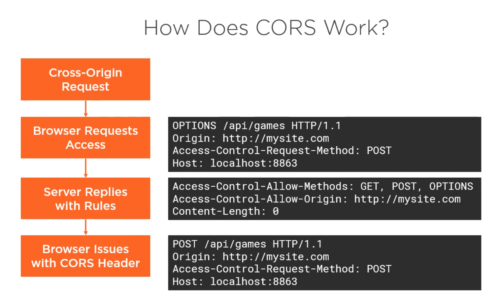

# Building a Web Api

# Verbs
* GET (Idempotent)
* POST
* PUT (Idempotent)
* PATCH  (Idempotent)
* DELETE (Idempotent)
* OPTIONS

# Nouns
* /customers
* /invoices
* /products
* /employees

# Response Codes
* 100-199: Informational
* 200-299: Success
* 300-399: Redirection
* 400-499: Client Errors
* 500-599: Server Errors

# Resources
* Nouns. e.g People, Invoices, Payments, Products
* Unit of data that need to be able to manipulate for the business case.
* URIs for path to resource. e.g api.server.com/people
* Query Strings for non-data elements. e.g format, sorting, searching etc.

# Designing Api
* Write down uris
* REST is important but be pragmatic. Functional API for actions.
* Use Dtos to allow for versioning and security.
* associations apis are child collections. e.g /api/camps/123/talks. These can be created as a seperate api. It should return the same format as /api/talks but only the talks relates to camps/123.
* Use Options verb and OperationsController for functional actions like refresh-cache. Don't fall into RPC trap.

| Resource | GET | POST | PUT | DELETE |
| ---      | --- | ---  | --- | ---    |
| /custmers| Get List | Create Item | Update Batch | Error |
| /custmers/123| Get Item | Error | Update Item | Delete Item |

# Formats
* Better to use accept header rather than /api/cusomter?format=json
* Accept */*, application/json, text/xml
* Content-Type: application/json 

# Testing Api
* [Postman](https://www.getpostman.com)

# Versioning Api
* Harder than product versioning as need to support new & old
* Path. e.g https://api.server.com/api/v1/customers. Clear to client what version is being used.
* Query String e.g htttps://api.server.com/customers?v=2.0
* Headers. e.g X-Version: 2.0. Can be easily added via Interceptor.
* Accept Headers (Request). e.g Accept: application/json; version=2.0 OR Accept: application/vnd.yourapp.camp.v1+json
* Content Type Headers (Response). e.g Content=Type: application/vnd.yourapp.camp.v1+json

# Dynamic
* By default the dynamic implementation is JObject

# Real-time Communication
* Comet
* gRPC
* SignalR
* Firebase
* Socket.IO
* Web Sockets

# CORS

# Authentication
* Cookies
* Basic Auth. Sends credentials on every request.
* Token Auth. Most Common. JWT is not encrypted but signed.
* OAuth. Use trusted third-party to identify.

# Pluralsight Courses for APIs
* [Building a RESTful API with ASP.NET Core](https://app.pluralsight.com/library/courses/asp-dot-net-core-restful-api-building/table-of-contents)
* [Building Business Applications with Angular and ASP.NET Core](https://www.pluralsight.com/courses/angular-aspdotnet-core-business-applications)
* [Documenting an ASP.NET Core API with OpenAPI / Swagger](https://app.pluralsight.com/library/courses/aspdotnet-core-api-openapi-swagger/table-of-contents)
* [Using OpenAPI/Swagger for Testing and Code Generation in ASP.NET Core](https://app.pluralsight.com/library/courses/asp-dot-net-openapi-swagger-testing-code-generation/table-of-contents)
* [Designing RESTful Web APIs](https://www.pluralsight.com/courses/designing-restful-web-apis)
